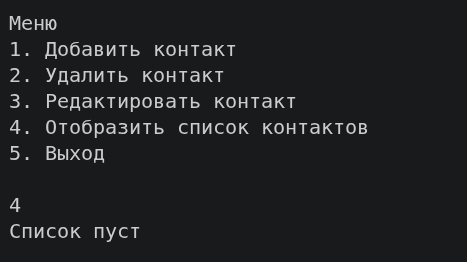
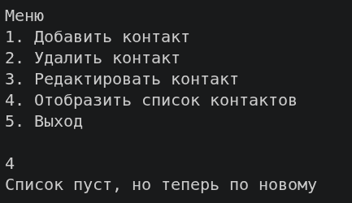

## Реализация динамической библиотеки

Исходный код библиотеки находится в файлах `src/contacts.c` и `src/contacts.h`. 
Сборка полностью автоматизирована через `Makefile` и проходит в два этапа:

1. Компиляция в позиционно-независимый код:
   Объектный файл для динамической библиотеки компилируется со специальным флагом `-fPIC`:
   ```bash
   gcc -Isrc -Wall -Wextra -O2 -fPIC -c src/contacts.c -o obj/contacts.o
   ```
2. Сборка динамического объекта (.so):
   Компилятор собирает разделяемую библиотеку с помощью флага `-shared`:
   ```bash
   gcc -shared obj/contacts.o -o lib/libcontacts.so
   ```

### Подключение к модулям проекта
Для использования функций двусвязного списка основное приложение (`main.c`, `menu.c`) и юнит-тесты (`test.c`) используют заголовочный файл:
```c
#include "contacts.h"
```
На этапе линковки бинарники связываются с библиотекой с помощью флагов поиска путей и её имени: `-Llib -lcontacts`. Код библиотеки внутрь бинарников не копируется.


## Запуск и проверка работы динамической библиотеки

Поскольку код библиотеки `libcontacts.so` не вшивается в исполняемый файл, стандартный запуск напрямую (например, `./bin/phonebook`) завершится ошибкой операционной системы ` error while loading shared libraries: libcontacts.so: cannot open shared object file: No such file or directory`. 

Для успешного старта системному линковщику Linux необходимо явно передать путь к папке `lib/` через переменную окружения `LD_LIBRARY_PATH`.

### Запуск через команды Make
В `Makefile` встроена автоматическая подстановка пути динамической библиотеки, что позволяет собирать и запускать проект короткой командой:

* Запуск основного приложения:
  ```bash
  make run
  ```
* Запуск юнит-тестов фреймворка Unity:
  ```bash
  make run_tests
  ```

### Тест на динамическое обновление
Динамическая линковка позволяет обновлять внутреннюю логику библиотек без необходимости пересобирать саму основную программу.
Запустим основной исполняемый файл без изменений и выведем список контактов

   

*Рис. 1. Исполнение программы до изменений*

Изменим строку вывода при пустом списке в функции `printPhoneBook` внутри файла `src/contacts.c`
```c

 if (*root == NULL)
  {
    printf("Список пуст, но теперь по новому\n");
    return -1;
  }

```

Пересоберём динамическую библиотеку

   ```bash
   gcc -Isrc -Wall -Wextra -fPIC -c src/contacts.c -o obj/contacts.o
   gcc -shared obj/contacts.o -o lib/libcontacts.so
   ```
Запустим основное приложение

   ```bash
   make run
   ```
 
 
 *Рис. 1. Исполнение программы после изменений*
