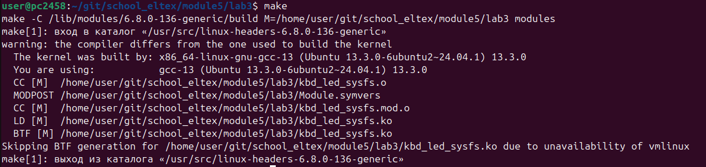
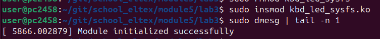
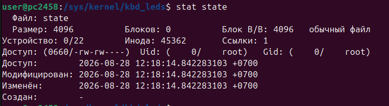

# Мигание светодиодов клавиатуры

Сборка с помощью Makefile:
```bash
make
```



Загрузка файла модуля:
```bash
sudo insmod kbd_led_sysfs.ko
```



После успешной загрузки в виртуальном каталоге `/sys/kernel` появится файл `kbd_leds/state`.



Управление светодиодами происходит записью значений в файл `state`. Значение — это двоичная маска: `1` (001), `2` (010), `7` (111).

* **1** — горит Scroll Lock
* **2** — горит Num Lock
* **3** — горит Caps Lock 

```bash
echo "7" | sudo tee /sys/kernel/kbd_leds/state
```
